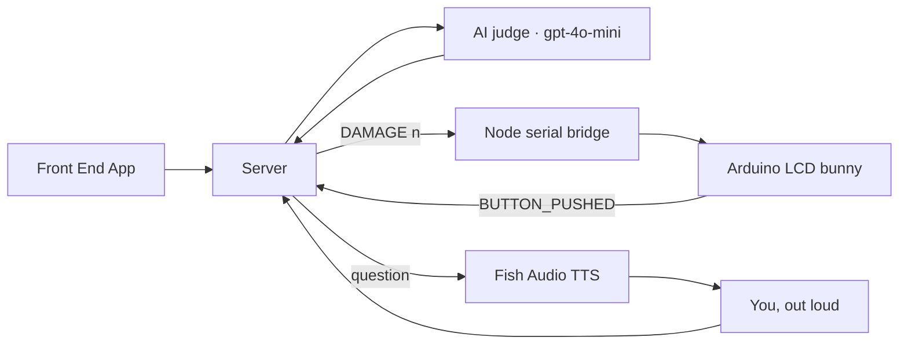

---
# try also 'default' to start simple
theme: slidev-theme-tahta
themeConfig:
  variant: soft
  accent: "#6f5ccb"
# https://sli.dev/features/drawing
drawings:
  persist: false
# slide transition: https://sli.dev/guide/animations.html#slide-transitions
transition: slide-left
# enable Comark Syntax: https://comark.dev/syntax/markdown
comark: true
# duration of the presentation
duration: 6min
layout: cover
bg: aurora
kicker: WDCC x SESA Hackathon 2026
title: HabitRabbit
subtitle: "A companion that feels what you forget"
---

---
layout: default
class: body-top
kicker: The problem
title: Attention is leaking, and nobody <em>feels</em> it.
---

<v-clicks>

- Bad habits and passive scrolling quietly erode focus, memory, and wellbeing
- Existing fixes — habit apps, screen-time limits — are easy to dismiss

</v-clicks>

<Reveal :delay="300">
<Callout tone="warn" icon="lucide:battery-low">No emotional stakes, no behavior change.</Callout>
</Reveal>

<!-- We've all got a habit app we installed and ignored within a week. The limit is easy to swipe past because nothing is actually at stake. -->

---
layout: stats
kicker: Recreational screen time
title: It's hurting the younger generation.
stats:
  - { value: 4.7, unit: "hrs", label: "Ages 8–12 · up from 2h19 in 2011", icon: "lucide:tablet-smartphone", tone: warn }
  - { value: 7.4, unit: "hrs", label: "Ages 13–18 · up ~90min since 2015", icon: "lucide:smartphone", tone: bad }
foot: "Source: WhenNotesFly — Screen Time Statistics 2026"
---

---
layout: bigtype
bg: mesh
kicker: The insight
title: 'What is HabitRabbit'
---

<!-- Not another notification you can dismiss. A face, in the room with you, that visibly needs you. -->

---
layout: steps
kicker: The loop
title: One companion, a daily loop
steps:
  - { title: "Set an intention", desc: "Tell it the habit you want to break", icon: "lucide:target" }
  - { title: "It watches quietly", desc: "Screen + mic activity, summarized locally", icon: "lucide:eye" }
  - { title: "Slip up, take damage", desc: "An AI judge scores the penalty", icon: "lucide:heart-crack" }
  - { title: "Reflect to heal", desc: "Answer a spoken question about today", icon: "lucide:sparkles" }
---

<!-- This is the whole product in four beats. Everything after this slide is how we built each step. -->

---
layout: diagram
glow: true
build: true
kicker: Under the hood
title: Four systems, one nervous system
note: The judge sits in the middle — every signal, human or hardware, routes through its judgment.
---

<!-- Screen tracking never leaves the machine — only a short activity summary reaches the judge. The bunny only ever sees DAMAGE / HEAL / BOTHER over serial. -->

---
layout: timeline
kicker: Roadmap
title: Where HabitRabbit goes next
events:
  - { date: Now, title: Solo bunny, desc: "One habit, one companion, hackathon build" }
  - { date: Later, title: On your phone, desc: "Right where the scrolling happens" }
  - { date: Someday, title: Open hardware kit, desc: "3D-printed shell, buy-the-parts guide" }
---

---
layout: end
bg: aurora
title: HabitRabbit
subtitle: A companion that feels what you forget
---

<Reveal :delay="300">
<Tags :items="['Screen tracker', 'gpt-4o-mini', 'Arduino', 'Fish Audio TTS', 'React']" />
</Reveal>
