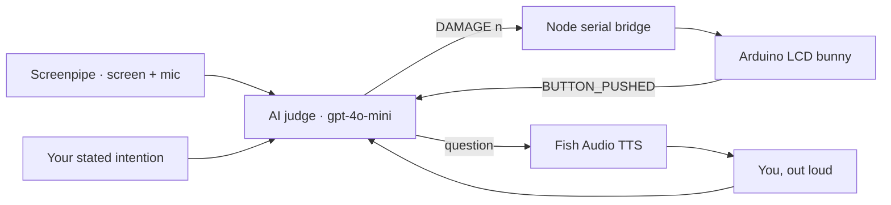

---
# try also 'default' to start simple
theme: slidev-theme-tahta
themeConfig:
  variant: soft
  accent: "#2546c7"
# https://sli.dev/features/drawing
drawings:
  persist: false
# slide transition: https://sli.dev/guide/animations.html#slide-transitions
transition: slide-left
# enable Comark Syntax: https://comark.dev/syntax/markdown
comark: true
# duration of the presentation
duration: 6min
layout: cover
bg: aurora
kicker: WDCC x SESA Hackathon 2026
title: HabitRabbit
subtitle: "A companion that feels what you forget"
---

---
layout: default
kicker: The problem
title: Attention is leaking, and nobody <em>feels</em> it.
---

<v-clicks>

- Bad habits and passive scrolling quietly erode focus, memory, and wellbeing
- Existing fixes — habit apps, screen-time limits — are easy to dismiss

</v-clicks>

<Reveal :delay="300">
<Callout tone="warn" icon="lucide:battery-low">No emotional stakes, no behavior change.</Callout>
</Reveal>

<!-- We've all got a habit app we installed and ignored within a week. The limit is easy to swipe past because nothing is actually at stake. -->

---
layout: fact
kicker: Screen time
value: "9"
unit: "hours"
label: daily screen time for Gen Z worldwide.
---

---
layout: bigtype
bg: mesh
kicker: The insight
title: A visible, <em>physical</em> cost.
subtitle: What if forgetting to reflect had one?
---

<!-- Not another notification you can dismiss. A face, in the room with you, that visibly needs you. -->

---
layout: feature
glow: true
kicker: Your companion
title: HabitRabbit
features:
  - { icon: "lucide:heart", title: "Healthy", desc: "Doing what you set out to do today" }
  - { icon: "lucide:heart-crack", title: "Damage", desc: "Caught doomscrolling instead" }
  - { icon: "lucide:heart-pulse", title: "Healing", desc: "Reflect out loud, recover together" }
---

<!-- A character that visibly needs you creates a different kind of accountability than a progress bar or notification you swipe away. -->

---
layout: steps
kicker: The loop
title: One companion, a daily loop
steps:
  - { title: "Set an intention", desc: "Tell it the habit you want to break", icon: "lucide:target" }
  - { title: "It watches quietly", desc: "Screen + mic activity, summarized locally", icon: "lucide:eye" }
  - { title: "Slip up, take damage", desc: "An AI judge scores the penalty", icon: "lucide:heart-crack" }
  - { title: "Reflect to heal", desc: "Answer a spoken question about today", icon: "lucide:sparkles" }
---

<!-- This is the whole product in four beats. Everything after this slide is how we built each step. -->

---
layout: vs
kicker: Two loops, one bunny
title: Slip up, or show up
label: vs
left: { title: Damage, items: ["Screenpipe flags doomscrolling / short-form loops", "AI judge compares activity to your stated intention", "Health drops, buzzer bothers you", "LCD face sags"] }
right: { title: Healing, items: ["Push the button, or just answer when asked", "It asks what you learned today", "Speak your answer into the mic", "Health recovers, face brightens"] }
---

---
layout: diagram
glow: true
build: true
kicker: Under the hood
title: Four systems, one nervous system
note: The judge sits in the middle — every signal, human or hardware, routes through its judgment.
---



<!-- Screenpipe never leaves the machine — only a short activity summary reaches the judge. The bunny only ever sees DAMAGE / HEAL / BOTHER over serial. -->

---
layout: panels
title: Four systems, one bunny
panels:
  - { icon: "lucide:monitor", title: Habit detection, items: ["Screenpipe records screen + audio locally", "A scheduled pipe summarizes activity every 10 minutes"] }
  - { icon: "lucide:scale", title: AI judge, items: ["gpt-4o-mini scores drift 0–100", "Judges activity against your stated intention"] }
  - { icon: "lucide:cpu", title: Arduino companion, items: ["LCD face, buzzer, push button", "Serial bridge: DAMAGE / HEAL / BOTHER / RESET"] }
  - { icon: "lucide:mic", title: Voice reflection, items: ["Fish Audio speaks the day's question", "You answer out loud to heal"] }
---

---
layout: code-explain
kicker: The AI judge
title: Judging consequences via JSON
notes:
  - "<strong>Context</strong> — your intention, saved URLs, and Screenpipe's activity summary go in."
  - "<strong>Strict output</strong> — the model is forced to return just a damage score and one reason."
  - "<strong>Clamped</strong> — damage is capped 0–100 before it ever reaches the bunny."
---

```js
const prompt =
  "You are the judge of a focus game. Decide how much the player " +
  "strayed from their intention. Respond with strict JSON only: " +
  '{"damage": <integer 0-100>, "reasoning": "<one short sentence>"}';

const damage = Math.max(0, Math.min(100, Math.round(rawDamage)));
await applyDamage(damage); // → serial: DAMAGE <n> → the bunny winces
```

---
layout: bigtype
bg: grain
kicker: Why a toy, not another app
title: A bunny wincing you <em>can't</em> ignore.
subtitle: Unlike a notification.
---

---
layout: timeline
kicker: Roadmap
title: Where HabitRabbit goes next
events:
  - { date: Now, title: Solo bunny, desc: "One habit, one companion, hackathon build" }
  - { date: Next, title: More habits, desc: "User-defined bad habits beyond doomscrolling" }
  - { date: Later, title: Smarter reflection, desc: "Spaced-repetition prompts, not just daily recall" }
  - { date: Someday, title: Open hardware kit, desc: "3D-printed shell, buy-the-parts guide" }
---

---
layout: end
bg: aurora
title: HabitRabbit
subtitle: A companion that feels what you forget
---

<Reveal :delay="300">
<Tags :items="['Screenpipe', 'gpt-4o-mini', 'Arduino', 'Fish Audio TTS', 'React']" />
</Reveal>
